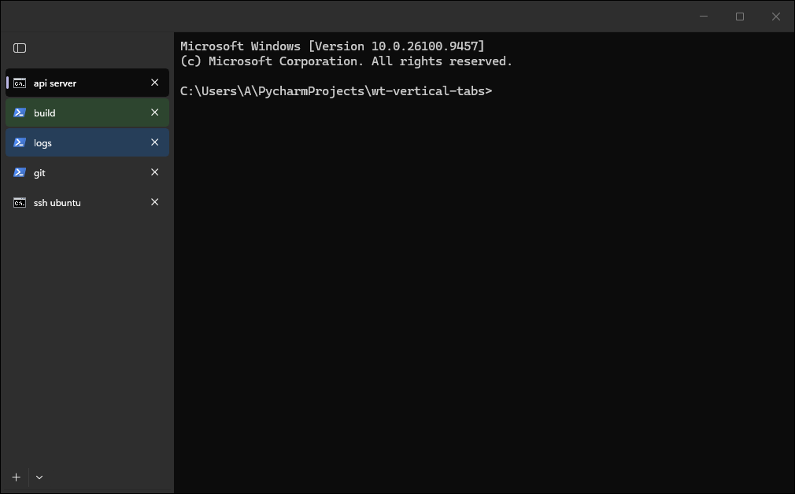
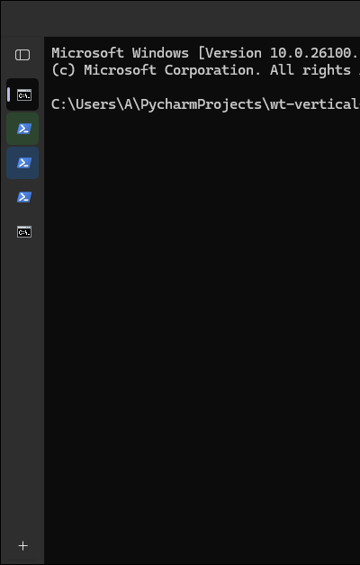
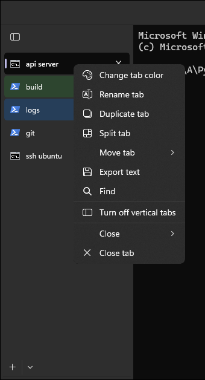

<div align="center">

  # wt-vertical-tabs

  **Browser-style vertical tabs for Windows Terminal, as a Windhawk mod: turned on from any tab's right-click menu, collapsible to an icon rail, and fully reversible.**

  [](LICENSE)
  [](https://github.com/latticelabs-au/wt-vertical-tabs/releases)
  [](#%EF%B8%8F-requirements)
  [](https://windhawk.net)

  [Quick start](#-quick-start) · [How it works](#-how-it-works) · [Releases](../../releases)
</div>

<p align="center"></p>

## What it does

Browsers solved "too many tabs" years ago by putting them down the side, where there is room for
titles. Windows Terminal still only has the horizontal strip, and the request for vertical tabs,
[microsoft/terminal#835](https://github.com/microsoft/terminal/issues/835), has been open since 2019.

wt-vertical-tabs is a [Windhawk](https://windhawk.net) mod that adds them to the Windows Terminal you
already have. Right-click any tab and choose **Turn on vertical tabs**: the strip moves into a
sidebar, each tab becomes a full-width row with its icon, title and close button, and a button at the
top of the sidebar collapses it to an icon rail and back, the way Edge does. **Turn off vertical
tabs** in the same menu puts Terminal back exactly as it was. Nothing on disk is patched: the mod
works on Terminal's live interface, in memory, while it runs.

---

## ✨ Features

- **Edge-style toggle.** "Turn on vertical tabs" and "Turn off vertical tabs" sit in every tab's
  context menu, in a group of their own above Close. Horizontal stays the default, and the choice is
  remembered across restarts.
- **Collapsible sidebar.** The pane button at the top of the sidebar collapses it to a 48 px icon rail
  and expands it again. Titles stay available as tooltips. Also remembered.
- **Terminal keeps working as before.** Tab colours, renaming, the tab context menu, the new-tab
  dropdown (it opens upwards from the foot of the sidebar), focus mode, full screen, multiple windows,
  light and dark themes.
- **Title bar on or off.** With "Show tabs in title bar" on, the title bar keeps the window buttons and
  becomes a plain drag area, like Edge in vertical tab mode. With it off, the normal Windows title bar
  stays and shows the active tab's title.
- **Live and exactly reversible.** Toggling, collapsing, changing settings, and enabling or disabling
  the mod all apply to open windows immediately. Turning it off restores the tab strip pixel for pixel.

---

## 🖥️ Requirements

- **Windows 11**, tested on 24H2. Windows 10 should work (Windows Terminal and Windhawk both run
  there) but is untested. x64 is tested; the mod also builds for ARM64 (CI compiles it), but it has
  not been run on an ARM64 device.
- **Windows Terminal 1.24**, tested on the portable build of 1.24.11911.0 (the Store package of the
  same release has not been run with the mod). Other builds that use the same WinUI 2.8 tab control
  should work. If a future Terminal changes the tab strip, the mod detects the unfamiliar layout
  and leaves the tabs alone rather than breaking them.
- **[Windhawk](https://windhawk.net) 1.7 or later.**

---

## 🚀 Quick start

1. Install [Windhawk](https://windhawk.net).
2. In Windhawk, choose **Create a New Mod**, replace the template with the contents of
   [`windows-terminal-vertical-tabs.wh.cpp`](windows-terminal-vertical-tabs.wh.cpp) (also attached to
   every [release](../../releases)), and click **Compile Mod**. Windhawk compiles it on your machine,
   so there is no binary to trust.
3. Exit the editor and check that the mod is enabled.
4. In Windows Terminal, right-click any tab and choose **Turn on vertical tabs**.

Terminal windows that are already open pick the mod up within a second or two. There is no need to
restart Terminal.

---

## ⚙️ Configuration

Open the mod's **Settings** tab in Windhawk.

| Key | Type | Default | Why it is there |
|-----|------|---------|-----------------|
| `sidebarWidth` | `int` | `220` | Width of the expanded sidebar in pixels, clamped to 120 to 600. Long profile names and SSH hosts want more room than the default; a narrow screen wants less. |
| `position` | `left` or `right` | `left` | Which side of the window the sidebar sits on. Right suits people who keep their shell prompt's attention on the left edge. |

Whether vertical tabs are on, and whether the sidebar is collapsed, are deliberately not settings.
They follow the context menu toggle and the collapse button, the same way a browser remembers them,
and are kept in the mod's own storage.

---

## 🧠 How it works

Windows Terminal draws its tabs with WinUI 2's `TabView`, inside a XAML island. There is no API to
change its layout from outside and nothing in Terminal's settings does it, so the mod works on the
live XAML tree.

**Finding the tabs.** The mod loads Windows' XAML Diagnostics interface into the process (the same
`InitializeXamlDiagnosticsEx` tool attach point that Visual Studio's Live Visual Tree uses) and
watches for Terminal's `TabRowControl`. It stays attached only for a few seconds around each new
window, because while it is attached the XAML runtime keeps state for every element it reports:
measured at roughly 100 KB per tab opened, and never given back. After that, new tabs are followed
through `TabView.TabItemsChanged`. Having loaded XAML Diagnostics at all still has a smaller cost,
covered under the caveats.

**Making it vertical.** The tab row moves out of the title bar into a column beside the terminal, and
the stock `TabView` template is rearranged in place. Its column definitions become rows (collapse
button, header, tab list, new-tab button), the list's `ItemsStackPanel` turns vertical, horizontal
scrolling is switched off, and each tab gets a row-shaped template. The template is rearranged
rather than replaced because the tab list owns the tab items, and moving live items from one list to
another fails inside XAML.

**The width fight.** `TabView::UpdateTabWidths` is written for a horizontal strip: it gives tabs fixed
widths, and turns horizontal scrolling back on when they do not fit. It only does that when width is
left over after the header, add button and footer, so the mod gives the footer a minimum width of the
whole sidebar. With no width left over, `UpdateTabWidths` takes its "not laid out yet" branch and
resets every tab to automatic width. It reads the footer's size before measuring the footer again, so
the mod measures the footer itself first.

**Putting it back.** Every property the mod changes is recorded with its previous local value and
restored when the layout comes off, except each tab's template, which goes back to the stock one.
Tree elements are held weakly, so a closed window is never kept alive. Row and column definitions
and flyouts are held strongly, because XAML discards the object behind a weak reference to them and
the restore would silently be skipped. Values that were template bindings are changed at their
source rather than overwritten, so restoring them brings the binding back.

**Staying out of the way.** The tab template is first tried on one tab, synchronously. If it fails
to instantiate (a theme resource renamed by some future WinUI, say), the tabs keep their stock look
in the sidebar rather than the error surfacing inside a layout pass and taking Terminal down. If the
strip's template itself is unfamiliar, the mod puts the tab row back where Terminal had it. Nothing
is left queued on a dispatcher when the mod unloads: deferred work runs from stoppable timers, and
every handler the mod adds is removed on the UI thread that owns it.

---

## 🖱️ Controls

| Action | Result |
|--------|--------|
| Right-click a tab, **Turn on vertical tabs** | Tabs move into the sidebar. |
| Right-click a tab, **Turn off vertical tabs** | Terminal's own horizontal strip, exactly as before. |
| Pane button at the top of the sidebar | Collapse to the icon rail, or expand again. |
| Hover a tab in the collapsed rail | Its title, as a tooltip. |
| Dropdown arrow next to **+** | Terminal's new-tab menu, opening upwards. The collapsed rail keeps only **+**. |

<p align="center"> </p>

---

## 🔨 Build from source

The mod is a single file, `windows-terminal-vertical-tabs.wh.cpp`, and Windhawk's editor is the normal
way to build it. `tools/build.py` runs the exact compiler invocation the Windhawk 1.7 editor uses, so
it can be scripted and run in CI:

```powershell
# compile for both architectures with an installed or portable Windhawk
python tools/build.py --windhawk "C:\Program Files\Windhawk"

# build with the test hooks and load it into a portable Windhawk, scoped to a test Terminal
python tools/build.py --windhawk C:\dev\windhawk --arch x86-64 --define WTVT_TEST_HOOKS `
    --install --include C:\dev\terminal\WindowsTerminal.exe
```

<details>
<summary>Testing without disturbing the machine</summary>

`tools/test-harness.wh.cpp` is a development-only companion mod for a portable test Terminal. It
creates that Terminal's windows on a virtual desktop named "WT test" and makes them unable to take
focus, so automated runs (UI Automation plus `PrintWindow` captures) never pull keystrokes or the
view away from whoever is at the machine. The scenario scripts that drove the 1.0 testing are not in
this repository yet; the release checklist in CONTRIBUTING.md covers the same ground by hand. Test
builds (`WTVT_TEST_HOOKS`) also accept a `WTVT_TEST_OPEN_TAB_MENU` window message that opens a tab's
context menu without real mouse input. Never install either into the Terminal you use day to day.

</details>

---

## ⚠️ Caveats and known limits

**Arrow keys inside the tab list do not move between tabs.** WinUI's `TabView` cancels Up and Down
focus movement between tabs, as a workaround for overlapping horizontal tabs. Switching tabs with
Ctrl+Tab and Terminal's own shortcuts is unaffected.

**Each tab you open costs about 35 KB more than without the mod, until Terminal restarts.** Once
XAML Diagnostics has been loaded into a process, the XAML runtime keeps a little extra state for
every tab created, attached or not, and there is no call to unload it. Opening and closing tabs in a
fresh Terminal, 120 at a time, each tab after the first round kept 37 to 55 KB with the mod loaded,
2 to 18 KB with stock Terminal, and 6 to 12 KB with a build of the mod that never loads XAML
Diagnostics. A thousand tabs in one Terminal session is about 35 MB; restarting Terminal gives it
back. Finding the tab strip through symbol hooks instead would avoid it, and is a possible future
change.

**Drag and drop is the least tested part.** Reordering in the sidebar and dragging a tab out to a
new window use WinUI's and Terminal's own drag handling, which the mod does not change, but the
automated tests cannot perform a real mouse drag. Terminal computes the drop position of a tab
dragged in from another window from horizontal coordinates, so such a tab can land in an
unexpected place in the sidebar. "Move tab to new window" from the tab menu is tested and comes up
vertical.

**Terminal's own menu keeps its horizontal words.** "Move tab > Move right" moves a tab down the
sidebar, and "Move left" moves it up.

**Long titles are clipped at the sidebar edge, not ellipsised.** The same happens on Terminal's own
tabs: Terminal lays each title out in a horizontal stack, which never trims.

**An elevated Terminal is a separate process.** Windhawk mods it the same way, and it reads the
toggle state when it starts, so toggling in a normal window does not change an elevated one that is
already open.

**It depends on Terminal's internals.** The mod recognises Terminal 1.24's tab strip by the names in
its WinUI template. A future Terminal that restructures the strip will get its stock tabs back, with a
line in the Windhawk log, until the mod is updated.

---

## 🤝 Contributing

See [CONTRIBUTING.md](CONTRIBUTING.md). In short: a pull request must compile for both architectures
with `tools/build.py`, keep the em dash out of Markdown and docs, and describe how it was verified
against a real Terminal.

---

## 📄 Licence

[MIT](LICENSE). Copyright (c) 2026 Lattice Labs.

<div align="center">
  🐨 Built with care in Australia · <a href="https://latticelabs.au">latticelabs.au</a> · <a href="mailto:hello@latticelabs.au">hello@latticelabs.au</a> · © 2026 Lattice Labs
</div>
